<!-- cspell:disable -->

# Defined coordinates: UI glossary

Every on-screen element that fork PR #112 (`timeline/defined-coordinates`) adds, what it means, and
exactly when it appears. Written 2026-10-09 for documentation and QA agents. The story behind each
element is in [HISTORY.md](HISTORY.md); exact strings, i18n keys, code and tests are in
[CHANGES.md](CHANGES.md) under the B-number given for each entry.

Terms used throughout:

- **TL** is timeline mode (the file's timeline flag is on). **PM** is page mode (what every released
  user runs).
- A marcher **moves** on a page when it has its own move ending in that page's box. It **holds**
  (or **follows**) when it has no move there and stands where its last move left it. An edit to the
  last move carries forward to every page it holds on.
- A marcher is **kept** on a page when the designer chose that it should not follow earlier pages
  there (TL only, stored in the file). Don't call this "pinned" or "locked": "pin" is the start
  flag's word (UI-11, UI-17), and "Lock here" was a deferred idea.
- The **selected page** is the page box the playhead is in.

About the screenshots: most were taken during the build, before the 2026-10-09 rebase onto #115
(transport keys). Since then the tooltips are #115's `ShortcutTooltip`, and they may look slightly
different from the tooltip frames below; the words are unchanged unless noted. Each caption says
which build it shows.

## Contents

1. [Hold marks on the page boxes](#1-hold-marks-on-the-page-boxes)
2. [The hold-mark tooltip](#2-the-hold-mark-tooltip)
3. [Inspector lines](#3-inspector-lines)
4. [Keep chains on the page boxes](#4-keep-chains-on-the-page-boxes)
5. [The chain icon on a marcher's dot (kept marchers on the field)](#5-the-chain-icon-on-a-marchers-dot-kept-marchers-on-the-field)
6. [Page box menu: keep entries](#6-page-box-menu-keep-entries)
7. [The K key](#7-the-k-key)
8. [Toasts](#8-toasts)
9. [What this PR removed or renamed](#9-what-this-pr-removed-or-renamed)

## 1. Hold marks on the page boxes

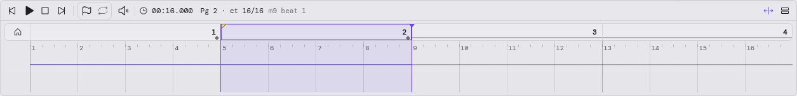

_TL, page 2 selected, all eight marchers selected (as of wp10). The marchers move on pages 1 and 2
(diamonds at the bottom right of those boxes) and hold on pages 3 and 4 (bars along the bottom)._

| Mark                                           | Means                                                      |
| ---------------------------------------------- | ---------------------------------------------------------- |
| **Diamond** (10×7 px, bottom right of the box) | Every selected marcher has its own move ending in this box |
| **Bar** (3 px, along the bottom of the box)    | Every selected marcher holds here (no move of its own)     |
| **Dashed bar** (same bar, 4 px on, 3 px off)   | Some selected marchers hold here, some move                |
| Nothing                                        | Nobody selected, or no selected marcher has a state here   |

- **When:** both modes. TL on the timeline's page boxes (B-27); PM on the page strip (B-28). Only
  while marchers are selected; every page box after home. A marcher partway through a longer move at
  the page's flag counts as neither.
- **PM caveat:** in page mode "holds" means "same position as the previous page" (within 1e-6), so a
  deliberate move back onto the same spot reads as a hold.
- **Not shown:** with nothing selected (owner decision: calm timeline). Whether to show them for the
  whole band with no selection is an open question.
- **Clicks:** the marks never take the pointer. A click on the box still selects the page.
- V-146.

## 2. The hold-mark tooltip

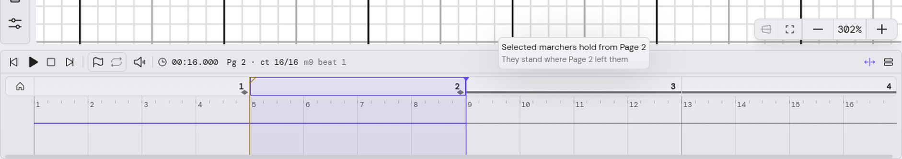

_TL, hover on page 3's box (as of wp10, on the stand-in tooltip; now #115's `ShortcutTooltip`)._

- **When:** after a 500 ms hover over a page box that shows a hold mark, or on keyboard focus. A
  press closes it until the pointer leaves, so clicks, scrubs and drags are undisturbed. No mark, no
  tooltip. Both modes (B-29).
- **Words** (label, then hint):
  - moves: "Selected marchers move on this page" · "They have their own move here";
  - holds: "Selected marchers hold from Page 2" · "They stand where Page 2 left them"; before any
    move, "Selected marchers hold from the start" · "They stand where they started" (visible in the
    [Keep here from the start](#keep-here-for-marchers-that-never-moved) frame below); from
    different pages, "Selected marchers hold on this page" · "They stand where their last move left
    them";
  - mixed: "Some selected marchers hold from Page 2" (or "…from the start", "…on this page") · "Some
    have their own move here".
- Screen readers get the same text through `aria-describedby`.
- V-182.

## 3. Inspector lines

All of these are **TL only** (page mode shows none). They sit in the marcher inspector under **Step
Size** (single selection) and in the multi-selection panel, for the selected page (B-30, B-41).
Nothing shows on the first page, partway through a move that passes the flag, off a flag, or with no
selection.

| Line                                                                                                                                          | When                                                                                                                                       | Click                                                                                                                                           |
| --------------------------------------------------------------------------------------------------------------------------------------------- | ------------------------------------------------------------------------------------------------------------------------------------------ | ----------------------------------------------------------------------------------------------------------------------------------------------- |
| **Hold from Page 2 →**                                                                                                                        | The selected marchers all hold here, and their last move ended on Page 2                                                                   | The link seeks to Page 2's flag. Tooltip "Go to Page 2, where these marchers last moved"                                                        |
| **Hold from the start →**                                                                                                                     | They hold and have never moved (was "Hold from Page 0" until wp10)                                                                         | Seeks to the start                                                                                                                              |
| **Moves on this page**                                                                                                                        | Each selected marcher has its own move ending in this box (plain text)                                                                     | —                                                                                                                                               |
| **These marchers hold here**                                                                                                                  | They all hold, but from different pages                                                                                                    | —                                                                                                                                               |
| **· Keep here**                                                                                                                               | After "Hold from …" or "These marchers hold here": they follow into this page                                                              | Keeps them here (one undo step). Tooltip "Keep OT1 and OT8 on Page 3, so editing Page 2 won't move them here"                                   |
| **Kept on this page · Follow again**                                                                                                          | They were kept on this page                                                                                                                | Follow again lets them follow earlier pages again (one undo step)                                                                               |
| **Some of these marchers are kept on this page**, or **Some of these marchers hold here**, then **Keep here · Follow again** on their own row | A mixed selection                                                                                                                          | Each button acts on the marchers in that state; the tooltip names them and counts the selection ("Keep OT1 (1 of the 2 selected) on Page 3, …") |
| **Pages 3–4 follow these marchers** (quiet, small)                                                                                            | On a page that later pages follow from ("Page 4 follows these marchers", "… some of these marchers"). Leaves out marchers that never moved | —                                                                                                                                               |

A button that the K key would run adds " (K)" to its tooltip. A move that goes nowhere but isn't a
kept spot still reads "Moves on this page".

### Hold from Page N and Moves on this page

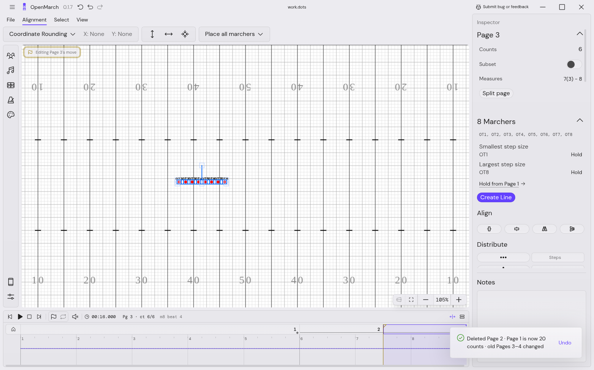

_TL, after Delete page and its moves (before the rebase): the inspector reads "Hold from Page 1 →"
under the step sizes. The toast is described in [section 8](#delete-page-and-its-moves-with-undo)._

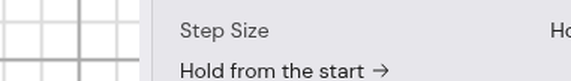

_"Hold from the start →" for marchers that haven't moved yet (as of wp10)._

### Pages that follow, and Keep here

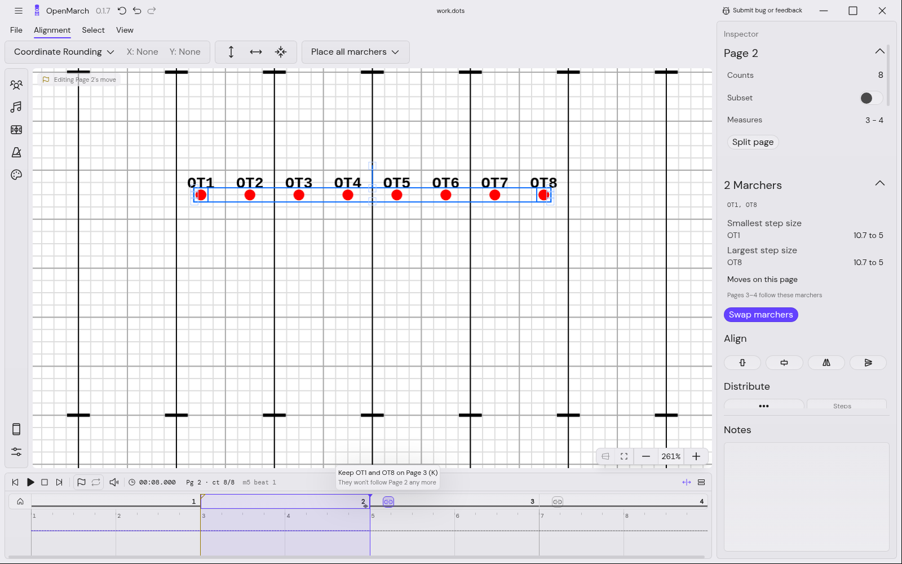

_TL, page 2, OT1 and OT8 selected (as of wp19): "Moves on this page", then the quiet "Pages 3–4
follow these marchers". The chain on page 3 is hovered (section 4)._

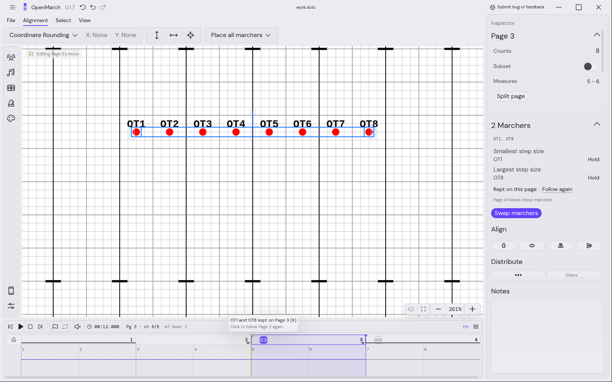

_TL, page 3 after keeping OT1 and OT8 there (as of wp19): "Kept on this page · Follow again", and
"Page 4 follows these marchers" (page 4 now follows the kept spot)._

### Keep here for marchers that never moved

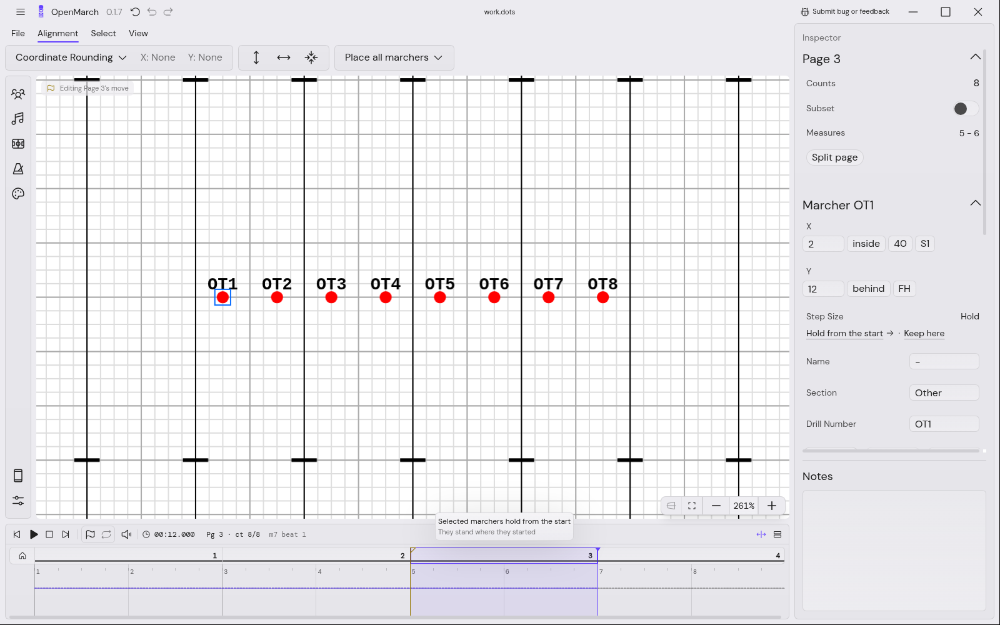

_TL, page 3, OT1 has never moved (as of wp19): "Hold from the start → · Keep here". A keep can come
before the first move; that move then walks back to the kept spot on page 3 (V-190). There is no
chain for never-moved marchers (section 4)._

## 4. Keep chains on the page boxes

A small chain button on each later page box that the selected marchers follow into (TL only, B-40,
V-185). It answers "is this page attached to the earlier one?" before you edit.

| State      | Look                                                      | Tooltip (label · hint)                                                                | Click                           |
| ---------- | --------------------------------------------------------- | ------------------------------------------------------------------------------------- | ------------------------------- |
| **Linked** | A chain as a quiet outline                                | "Keep OT1 and OT8 on Page 3" · "They won't follow Page 2 any more"                    | Keeps those marchers there      |
| **Kept**   | A broken chain on a filled accent chip                    | "OT1 and OT8 kept on Page 3" · "Click to follow Page 2 again"                         | Lets them follow again          |
| **Mixed**  | A chain outlined in the accent, with a filled count badge | "2 of the 8 selected are kept on Page 3 (OT1, OT8)" · "Click to keep the other 6 too" | Keeps the rest (_lead default_) |

_Linked: page 2 selected, chains on pages 3 and 4 (as of wp19)._

_Kept: the filled accent chip on page 3; page 4 still shows a linked chain (as of wp19)._

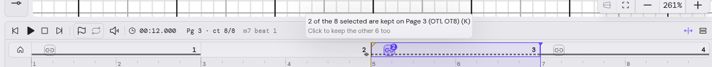

_Mixed: all eight selected, two of them kept on page 3. The badge counts the kept ones; page 3 also
shows the dashed hold mark (as of wp19)._

- **When:** only with marchers selected (owner: nothing without a selection). On each page box the
  selection follows into, or was kept on. Marchers that haven't moved yet get no linked chain (on
  every box it was noise), but a kept one still shows the kept chip.
- **Where:** a 20 px button, 22 px in from the flag before its box (centered in boxes narrower than
  70 px), so the selected page's flag, the start flag and the playhead never cover it.
- **Clicks:** a press never selects, scrubs or drags the box. Right-click opens the page box menu
  (section 6). The chain that K would toggle adds " (K)" to its tooltip label.
- **Names:** up to three ("OT1, OT2 and OT3"), then "OT1, OT2 and 4 others"; one marcher reads "It
  won't …"; several source pages or the start read "They won't follow earlier pages any more".
- **Relation to the field icon:** the kept chip and the field icon (section 5) use the same broken
  chain. The chip is per page box and needs a selection; the field icon is per marcher, on the
  current page only, and needs none.

## 5. The chain icon on a marcher's dot (kept marchers on the field)

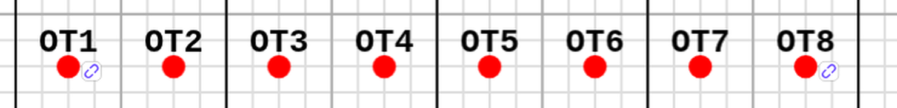

_TL, page 3, nothing selected, OT1 and OT8 kept on page 3 (wp20, current build)._

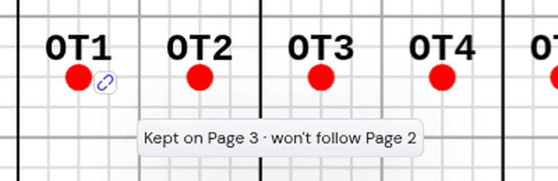

_Hovering the icon or OT1's dot (wp20, current build)._

**What it means:** this marcher is **kept** on the current page. Editing an earlier page won't move it
here; it stays at its kept spot. Its kept spot is a stored, deliberate decision (B-38), not a move
that happens to end where it started.

- **When it shows:**
  - TL only (nothing in page mode).
  - On the **current page only** (the page box the playhead is in, as the inspector uses), for each
    marcher kept on that page. A marcher kept on page 3 shows no icon on pages 2 or 4.
  - **Regardless of selection**: it shows with nothing selected. This is the at-a-glance check that
    both final study users asked for.
  - **Hidden** while playing, while a scrub is held down, and while a move is isolated (its members
    are drawn at the move's plan).
  - Hidden marchers get none; dimmed marchers' icons dim with them.
- **When it changes:** it appears and disappears on keep, follow again, undo, redo and page change.
  Editing a kept spot's ending (a drag on its page, or the inspector's destination) turns it into an
  ordinary move, which clears the marker, so the icon goes away.
- **Tooltip:** hover on the icon or on its dot for 500 ms: "Kept on Page 3 · won't follow Page 2", or
  "Kept on Page 3 · won't follow earlier pages" for a keep made before any move. A press or leaving
  the canvas hides it.
- **Look:** Phosphor `LinkSimpleBreak` (bold) in the light accent, on a small white rounded square
  with a faint edge, so it reads over yard lines. Just right of the dot and a little below its
  center, clear of the drill number. 12 field units on screen, held between 10 and 16 px (_lead
  default_). It is one canvas layer above the marchers (`TimelineKeptLayer`); it can't be selected
  and takes no clicks.
- **Relation to the timeline chip:** the same symbol as the kept chip on the page box (section 4).
  The chip tells you about the **selected** marchers on **every** page; the icon tells you about
  **every** marcher on the **current** page.
- B-45, V-191, ui.md UI-18 "Kept marchers on the field".

### Why a chain glyph and not a faded dot

The owner was shown five mock-ups on 2026-10-09 (A thin ring, B small badge, C corner dot, D chain
glyph, E chain glyph plus a faded dot) and chose **D**.

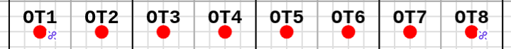

_Mock-up D (chosen): the chain glyph alone._

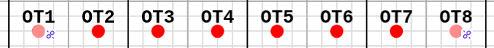

_Mock-up E (rejected): the glyph plus the dot at about 45% opacity._

Opacity was rejected because **dimming already means something on the field**: marchers outside an
isolated move are dimmed, and a dimmed marcher can't be selected or edited (ui.md isolation, V-15).
A faded kept marcher would read as "not editable here", which is wrong: a kept marcher is fully
editable on its page. The glyph adds information without taking any away.

## 6. Page box menu: keep entries

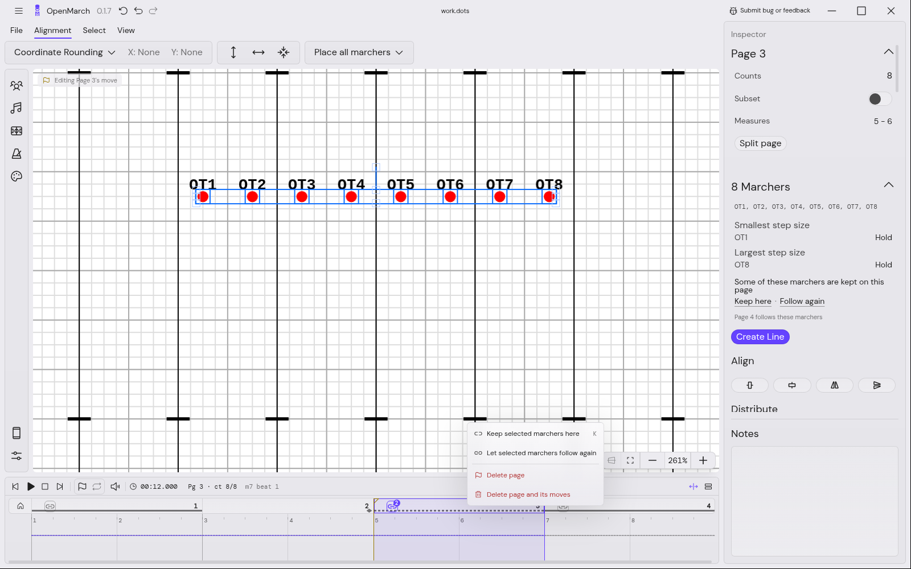

_TL, right-click on page 3 with a mixed selection (as of wp19). The inspector reads "Some of these
marchers are kept on this page · Keep here · Follow again"._

- **Keep selected marchers here** and **Let selected marchers follow again**, above **Delete page**
  and **Delete page and its moves** (B-42, V-187).
- **When:** both entries show whenever marchers are selected; each is enabled only when some selected
  marchers are in that state on the box (some follow / some kept). Neither shows without a selection.
- They act on the marchers in that state, one undo step each.
- The entry K would run from the current page shows a quiet "K" on its right (only that one, so the
  key never promises another page).

## 7. The K key

- **K** keeps or lets follow again, from the selected page (TL only; does nothing in page mode, while
  playing, or in a text field). B-43, V-188.
- Where some selected marchers **hold** on the current page (follow, or are kept there), K toggles
  keep there, for those. Where they all **move** on it (or are mid-move), it toggles keep on the next
  page box (from home: the first box). Marchers that never moved count as holding, so K before any
  move keeps the current page.
- Toggling keeps the ones that follow, or, when none does, lets the kept ones follow again; with some
  of each it keeps the rest. No toast.
- The chain, menu entry and inspector button that K would run say " (K)" or show "K".
- It is listed in #115's `?` shortcuts dialog under Timeline: "Keep the selected marchers where they
  hold on this page (on the next page if they move here), or let them follow again".

## 8. Toasts

Toasts are kept for surprises. Ordinary edits and nudges are silent (B-25). One surprise toast shows
at a time: each new one replaces the last (B-37), and a run of edits on the same page or window with
the same marchers adds up behind one toast (B-36, V-184). Toasts with two buttons put them on their
own row under the text (B-26).

### Pass-through: "Page 3 is no longer a stop · Keep Page 3 as a stop"

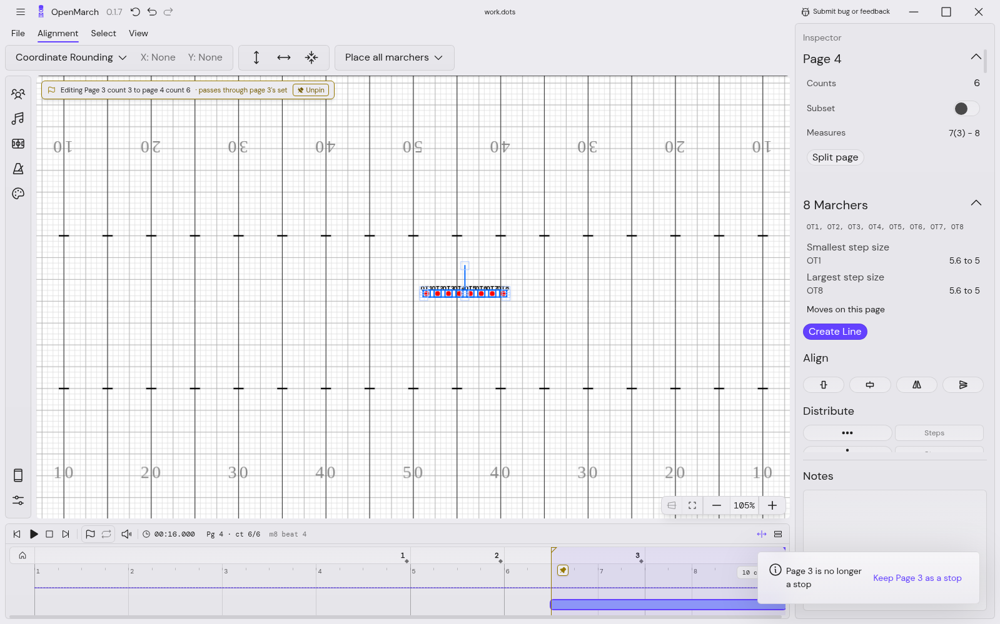

_TL, a window from page 3 count 3 to page 4 count 6 dragged across page 3's flag (before the rebase;
the field line above the canvas predates #115)._

- **When:** TL, whenever a window edit passes a page flag (B-24, V-144). "Pages 3–4 are no longer
  stops" for several. With no flag inside (it crossed only moves): "Moves straight through …, then
  catches up to …'s set", worded in pages and counts since wp17.
- **Keep Page 3 as a stop** re-runs the edit from the last flag inside, so page 3 shows its set again;
  the window follows.
- It wins over Move them too and Only Page N for that edit.

### Page mode: "Pages 3–4 followed (they were copies) · Only Page 2"

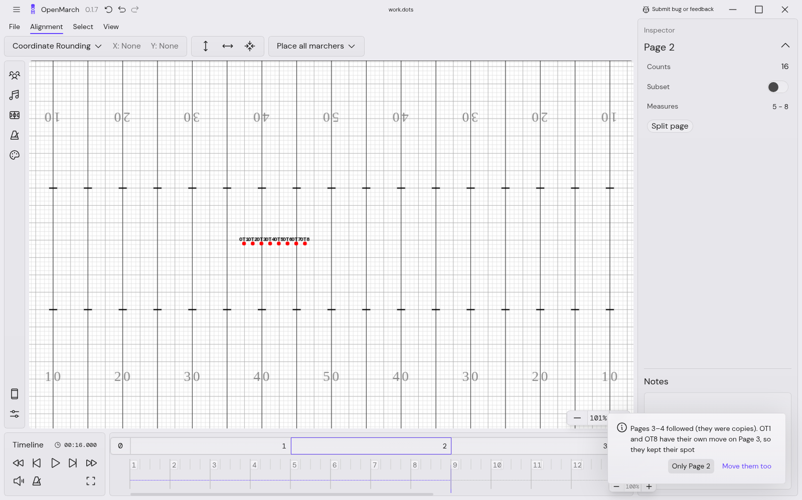

_PM, after shortening the page 2 move for everyone (as of wp14). The plain version has only the first
sentence and one button._

- **When:** PM, after any write that carried forward into later copies (B-16, V-141). "Page 3
  followed (it was a copy)" for one page.
- **Only Page 2** ("Only the edited pages" for several) puts the followed pages back as a **second**
  undo step. Rows changed since are left alone.
- When the same edit also split the group (some marchers kept their own later move), the toast adds
  the Move them too sentence and button, as above.

### Move them too

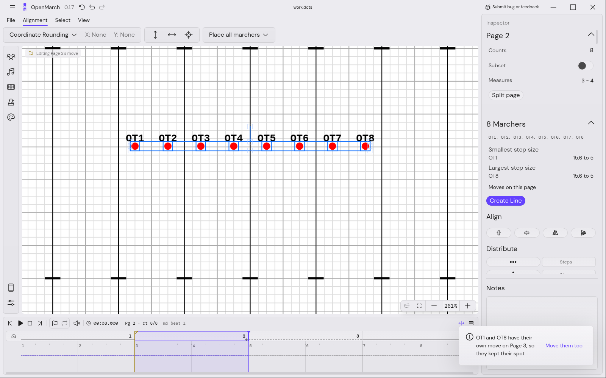

_TL, after shortening the page 2 move (as of wp11)._

- **When:** both modes, only when an edit **splits a group** at a later page: some edited marchers
  follow there because they hold, and others stop because they have their own move there (B-22,
  B-23, V-181). Fully held or fully written shows stay silent.
- Words: "OT1 and OT8 have their own move on Page 3, so they kept their spot" ("… has its own move …,
  so it kept its spot" for one; "… have their own later moves, so they kept their spots" for several
  pages).
- **Move them too** shifts their move on that page by the same amount, as its own undo step. In TL it
  is the only button; in PM it shares the followed toast with Only Page N.
- In TL the pass-through toast wins.

### Timeline: "Pages 3–4 followed · Only Page 2"

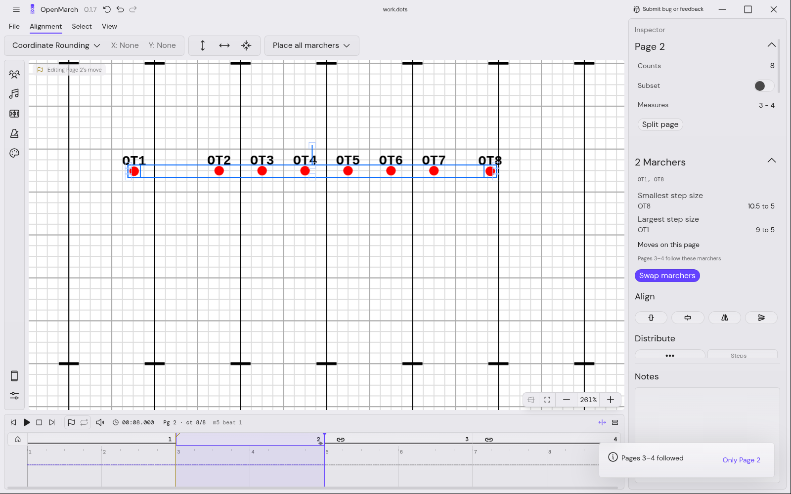

_TL, after changing the existing page 2 move of OT1 and OT8 (as of wp19)._

- **When:** TL, after a range edit ending on a page flag that changed an **existing** move of some
  marchers and carried them into the next page box (B-44, V-189). A page's first move stays silent.
  Kept marchers don't count. It shows only when neither the pass-through toast nor Move them too
  does.
- **Only Page 2** keeps those marchers on the next page box at their spots from before the edit (one
  undo step), so later pages look as before; the chain then shows them kept.

### Delete page and its moves, with Undo

_TL, after Delete page and its moves on page 2 (before the rebase). The view stays on the merged page._

- **When:** TL, after **Delete page and its moves** (B-10, V-142). Plain **Delete page** in TL is a
  flag delete that keeps every later page's look, and has no such toast.
- Says which page was deleted, which pages grew ("Page 1 is now 20 counts"), and which pages changed
  (old numbers for renumbered pages), or "No other page changed".
- **Undo** runs the app's normal undo. The toast closes on the next edit, undo or redo, so it can only
  ever undo the delete.

### Delete move: "Deleted Move 2 · Pages 2–3 changed"

- **When:** TL, after UI-14's **Delete move** (B-12, V-183). Marchers that held after the move fall
  back, so the toast names the pages whose flag now looks different ("Page 4 changed" for one). Undo
  as before. No screenshot.

### Refusals

Error toasts from the timeline's write refusals now name pages and counts rather than "the move over
beats [9, 13)" (wp18). They are worded by `timelineRangeWords.ts`.

## 9. What this PR removed or renamed

For writers updating older material:

| Was                                                                                                                                    | Now                                                                       |
| -------------------------------------------------------------------------------------------------------------------------------------- | ------------------------------------------------------------------------- |
| Pass-through toast naming marchers ("OT1, OT2 … now move straight through Page 3") with **Only change Page N** / **Start from Page N** | "Page 3 is no longer a stop" · **Keep Page 3 as a stop**                  |
| Timeline carry-forward toast "Also moves Pages 3–4" (wp5)                                                                              | Removed after study 08; hold marks show it                                |
| Inspector "Holding since Page X" / "Moves here" (wp5)                                                                                  | "Hold from Page 2 →" / "Moves on this page"                               |
| "Hold from Page 0"                                                                                                                     | "Hold from the start"                                                     |
| Page-mode toast "Also moved on Pages 3–4"                                                                                              | "Pages 3–4 followed (they were copies)"                                   |
| Delete toast "Deleted Page 2 and its moves · Pages 2–3 changed"                                                                        | "Deleted Page 2 · Page 1 is now 32 counts · old Pages 3–4 changed" + Undo |
| Native `title` tooltips on hold marks (wp7), then a stand-in `HintTooltip` (wp10)                                                      | #115's `ShortcutTooltip` (since the 2026-10-09 rebase)                    |
| Alt+drag "this page only" (prototype B)                                                                                                | Not built (dropped by the owner)                                          |
