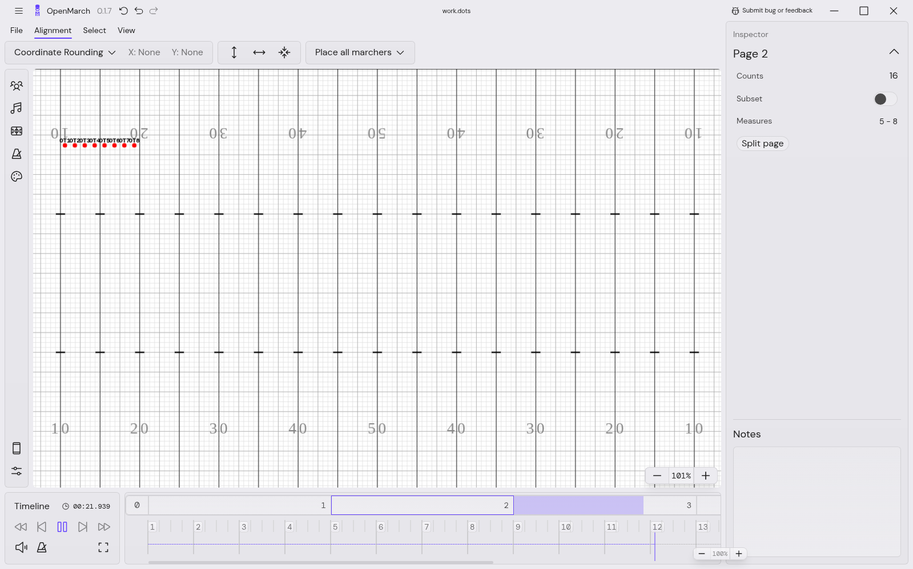
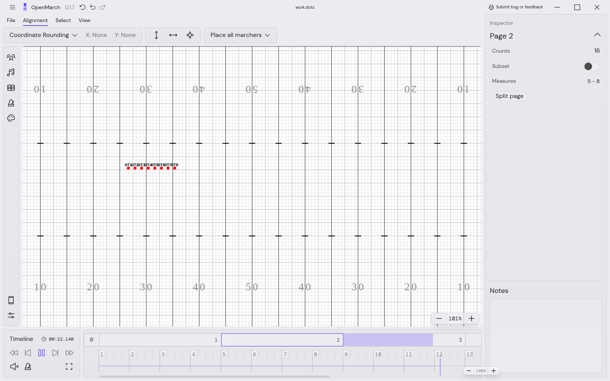
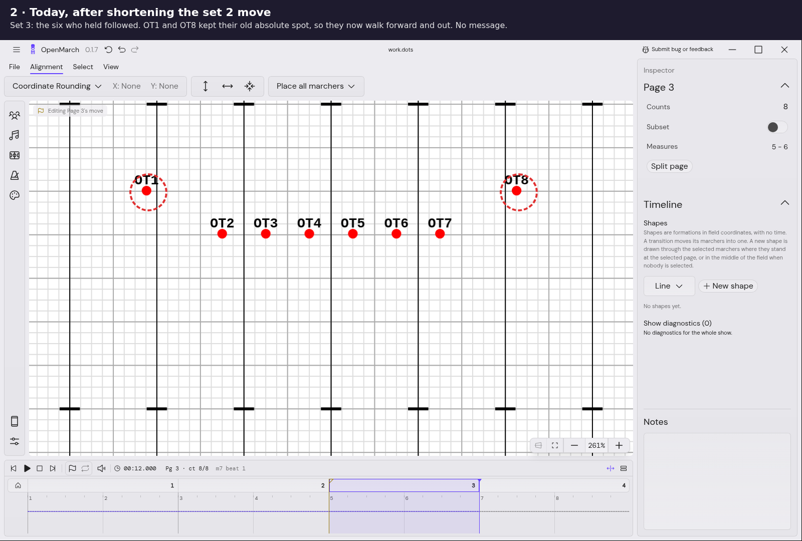
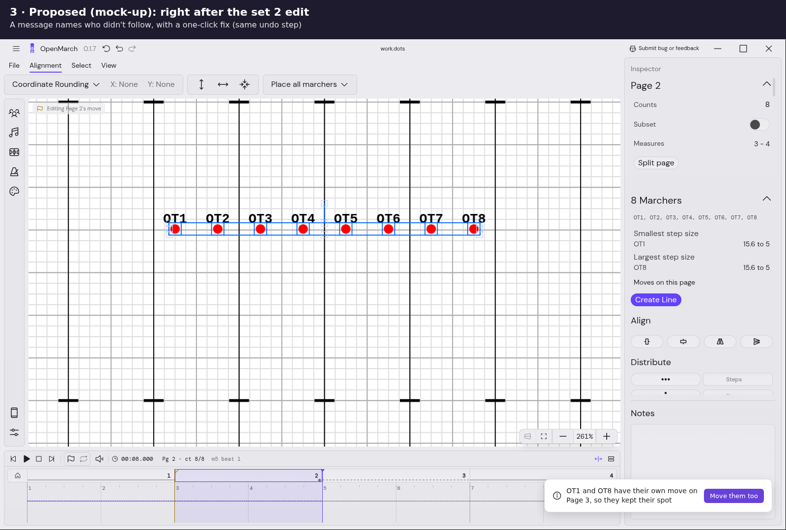

<!-- cspell:disable -->

# Defined coordinates: what happened in this PR

The story of fork PR #112 (`AlexDumo/OpenMarch-timeline`, branch `timeline/defined-coordinates`),
from the owner's bug report on 2026-10-08 to the rebase onto #115 on 2026-10-09. Written 2026-10-09
for future documentation and QA agents, so they know why each piece exists, what it replaced, and
which screenshots are current.

**Start here:**

- This file: the chronology, the studies, the bugs and what is still open.
- [GLOSSARY.md](GLOSSARY.md): every on-screen element the PR adds, with a screenshot and exactly when
  it appears (including the chain icon on the field).
- [CHANGES.md](CHANGES.md): the code-grounded catalog (B-01 … B-45) with strings, i18n keys, files,
  tests, a QA script and coverage gaps.
- [README.md](README.md): the research summary and the owner's decisions.
- The rule itself: `docs/timeline/ui.md` UI-18 and the two `docs/adr/0001-timeline-motion-model.md`
  amendments (2026-10-08, 2026-10-09). Lead defaults to check by hand: V-140 … V-149 and V-181 …
  V-191 in `docs/timeline/research/ownership/VALIDATION.md`.

## At a glance

| Date       | What                                                                                                                   |
| ---------- | ---------------------------------------------------------------------------------------------------------------------- |
| 2026-10-08 | Owner's report; research (current model, prior art, three models, three validators); owner decides four questions      |
| 2026-10-08 | ADR 0001 amendment, ui.md decision (first numbered UI-15); wp1–wp6 built; PR #112 opened; owner answers V-148, V-149   |
| 2026-10-08 | Owner finds the feedback text busy; persona study 08; wp7 (hold marks) and wp8 (shorter toasts, inspector, bug fixes)  |
| 2026-10-09 | First-time-user study 09; wp9 (Ctrl+A); owner asks for real tooltips and Move them too; merge of timeline-try-2; UI-18 |
| 2026-10-09 | wp10 (tooltips), wp11 (Move them too); owner: document and test everything; CHANGES.md; wp12–wp14                      |
| 2026-10-09 | Owner: edit an earlier page without later pages following; prototypes A/B/C and study 10; wp15–wp18 (keep later pages) |
| 2026-10-09 | Final two-user check; wp19 (keep fixes); owner picks the field icon (mock-up D); wp20; rebase onto #115; these docs    |

## 1. The report (2026-10-08)

> If I make multiple pages after page 1, say 2 3 4, all of those pages have the same coords as
> page 1. Then I edit page 2 to be a new move. Then when I go to page 3, rather than being page 2
> (which is where they are now) they are still the page 1 coordinates.

_Page mode, base build (`a4d42cd1`): pages 2–4 added after page 1, page 2 edited (the band moved to
the 30), then played into page 3. The band is back at page 1's set._

_The same steps on this branch: page 3 shows page 2's set, because pages 3–4 were untouched copies and
followed the edit._

## 2. The research (2026-10-08)

Notes [01](01-current-model.md), [03](03-prior-art.md), [04](04-model-touched.md),
[05](05-model-sparse.md), [06](06-model-tracking.md), [07a](07a-validation-timeline-core.md),
[07b](07b-validation-page-mode.md), [07c](07c-validation-extras-ux.md); summary in
[README.md](README.md).

**Two bugs, one symptom:**

- **Page mode** (what every released user runs) stores a full copy of every marcher on every page. A
  new page is a one-time copy, and editing page 2 writes only page 2. Pages 3–4 keep page 1's copy.
- **Timeline mode is already sparse:** no move means a hold (spec R-6), so the timeline's **+** flag
  already did what the owner expected. The bug there came from automatic "stay" moves that froze a
  copy of the position: the page-add ripple (`addHoldingMoves`), the converter, new-marcher stays,
  and set to previous/next page.

**Prior art:** drill tools copy sets and offer a manual re-sync. Animation tools and DAWs store only
keys. Lighting consoles' **tracking** (ETC Eos) is the closest: an edit carries forward until the
next cue that sets its own value, with escape hatches (cue only, block, a delete that keeps later
cues' look). The kept spots built later are Eos's "block", stored.

**Three models** (M1 dense rows plus a stored "defined" flag; M2 sparse; M3 sparse plus pins, "keep
later pages" and cue-only delete) all agreed on timeline mode: stop writing automatic stays. Three
validator agents prototyped them. The sparse timeline core kept positions at every flag
bit-identical across an 8-file conversion corpus (38–61% of slots in real files were copies). They
found the companions it must ship with (set to next page, align/distribute on unmoved marchers,
ripple delete, the Only change toast), and that page mode can carry edits through exact copies with
hardening (tolerance, a merge leak, undo cost, pre-existing pathway bugs).

## 3. The decision (2026-10-08)

The owner answered all four questions as recommended (README "Decisions"):

1. **The sparse model:** a marcher has a coordinate on a page only where the designer moved it there;
   everywhere else it holds. An edit carries forward, per marcher, to that marcher's next page with
   its own move, and stops there. Recorded as the **ADR 0001 C-12 amendment of 2026-10-08** and the
   ui.md decision now numbered **UI-18** (first written as UI-15; renumbered on 2026-10-09 because
   UI-15/16 went to timeline edges and UI-17 to transport keys).
2. **Page mode carries edits forward now** through untouched equal copies (per marcher, within a
   tolerance), with an "Only Page N" toast and the pre-existing fixes. No schema change.
3. **Delete page in timeline mode keeps later pages' look** (a flag delete); "Delete page and its
   moves" is explicit.
4. **Lock here and Keep later pages deferred** (reversed on 2026-10-09, section 4.8).

After the first build, on 2026-10-08: Delete page and its moves keeps tracks inside the box (V-149),
and page-mode shape edits carry forward (V-148).

## 4. What was built

Twenty work packages (`dc/wp1-…` to `dc/wp20-…`), each built in its own worktree and merged into the
branch. Grouped by theme, in the order they landed. B-numbers point into [CHANGES.md](CHANGES.md).

### 4.1 Stop writing on a page's behalf (wp1, wp2; 2026-10-08)

- **wp1 `dc/wp1-no-auto-stays`.** _Problem:_ adding, splitting or appending a page, adding a marcher,
  and converting a show all wrote zero-motion "stay" moves, which froze page 1's copy. _Result:_ none
  of them writes timeline rows any more; new marchers get a home only; the converter writes a slot
  only where a position changes; undoing a marcher add keeps the current page. (B-01, B-02, B-06,
  B-31)
- **wp2 `dc/wp2-writers`.** _Problem:_ align, distribute and inspector edits on marchers that didn't
  move planted stays too; set to next page was refused on a held page. _Result:_ a write that moves
  nobody writes nothing (and adds no undo step); a drag back onto the start of an own page move clears
  it; set to previous page makes the page follow again; set to next page works on held pages.
  (B-03 … B-05)

### 4.2 Delete (wp3, wp6, wp13; 2026-10-08 and 09)

- **wp3 `dc/wp3-delete`.** _Problem:_ deleting a page rippled moves and made later pages change.
  _Result:_ timeline **Delete page** is the flag delete (later pages keep their look); **Delete page
  and its moves** is explicit and names the pages that change; a deleted page's tag appearances move
  to the next page. (B-08, B-09, B-13)
- **wp6 `dc/wp6-followups`.** Delete with moves after a flag delete was refused (E-A3); fixed. Toast
  strings moved to `en.json`.
- **wp13** later found that Delete page and its moves deleted a user's window move ending at the
  deleted page's flag, and that the delete toast's Undo stayed after a later edit; both fixed (section
  6).

### 4.3 Page mode carries edits forward (wp4; 2026-10-08)

- **wp4 `dc/wp4-page-mode`.** _Problem:_ the owner's bug as every user sees it. _Result:_ an edit on
  page N also moves that marcher's following pages that still equal the old position, stopping at a
  different value, a shape page, or a row with its own pathway. A toast offers **Only Page N**, which
  puts them back as a second undo step. With it, four pre-existing page-mode bugs were fixed: a new
  page shared the previous page's curved pathway, `pathways` wasn't in undo history, page-mode undo
  didn't go to the edited page (`rowIdFromSql` returned NaN), and followed pages didn't refresh.
  (B-14 … B-21)

### 4.4 Feedback, first version, then replaced (wp5 → wp7, wp8; 2026-10-08)

- **wp5 `dc/wp5-feedback`** added a timeline toast after every carry ("Also moves Pages 3–4") and an
  inspector line "Holding since Page X" / "Moves here". The owner found it "not super helpful, just
  kind of busy", which led to study 08 (section 5).
- **wp7 `dc/wp7-hold-marks`.** _Problem:_ users couldn't see which pages an edit carried into without
  clicking through them. _Result:_ hold marks on the page boxes for the selected marchers, in both
  modes. Nothing without a selection. (B-27, B-28)

  

  _Hold marks (as of wp10, which made the bars 3 px and the diamond larger)._

- **wp8 `dc/wp8-text-and-bugs`.** _Problem:_ toasts on every edit, long toasts, an inspector line
  nobody saw. _Result:_ the timeline carry toast is gone (ordinary edits are silent); shorter toasts
  for the three surprises (pass-through, page-mode copies, delete with **Undo**); the inspector line
  became "Hold from Page 2 →", a link next to Step Size. It also fixed the three bugs the study hit
  (stale selection box, window label after Keep as a stop, the view jumping to Home after a delete).
  (B-10, B-11, B-16, B-24, B-25, B-30, B-32, B-33)

  

  _The pass-through toast after wp8 (screenshot from before the rebase; the field line above it predates #115)._

  

  _Delete page and its moves, with Undo; the view stays on the merged page (before the rebase)._

### 4.5 Tooltips (wp10; 2026-10-09)

- **wp10 `dc/wp10-tooltips`.** _Problem:_ the hold marks had native `title` tooltips, which the owner
  wanted as real tooltips like the transport keys' `ShortcutTooltip`; "Hold from Page 0" made no sense
  before any move. _Result:_ Radix tooltips with a label and a hint, stronger marks, and "Hold from the
  start". Built on a stand-in (`HintTooltip`) because #115 hadn't landed; swapped for #115's
  `ShortcutTooltip` in the rebase (section 7). (B-29, B-30)

  

  _The hold-mark tooltip (as of wp10, on the stand-in)._

  

### 4.6 Move them too (wp11, wp12, wp14; 2026-10-09)

Study 09 found that shortening the page 2 move surprised every non-expert: the marchers that held
through page 3 followed, but OT1 and OT8, who had their own page 3 move, kept their absolute spot and
now walked diagonally.

_The surprise, from study 09 (annotated frame at `9343e614`, before Move them too)._

_The proposal shown to the owner (mock-up drawn on a real frame)._

- **wp11 `dc/wp11-move-them-too`.** _Result:_ a toast names who kept their spot, and **Move them too**
  shifts their later move by the same amount, as its own undo step, in both modes. It also made UI-14's
  Delete move toast name the pages that change. (B-12, B-22, B-23)

  

  _As built (timeline mode, as of wp11)._

- **wp12 `dc/wp12-mtt-trigger`.** _Problem:_ the catalog review found Move them too fired on nearly
  every edit. _Result:_ only when an edit **splits a group** at a later page; in timeline mode the
  pass-through toast wins; in page mode one toast carries both "followed" and Move them too, with
  Only Page N beside it.
- **wp14 `dc/wp14-mtt-polish`.** Two-button toast layout (buttons on their own row); runs of edits add
  up (several nudges move by all of them; Only Page N goes back to before the first); a fresh id per
  surprise toast. (B-26, B-36, B-37)

  

  _Page mode's combined toast (as of wp14)._

### 4.7 Hygiene and wording (wp9, wp13, wp17, wp18; 2026-10-09)

- **wp9 `dc/wp9-selectall`.** Ctrl+A and Ctrl+S also ran the A/S nudge shortcuts on Linux and Windows,
  moving a marcher (pre-existing; same fix as upstream #1044). (B-34)
- **wp13 `dc/wp13-gap-tests`.** 63 tests in 7 files for the catalog's coverage gaps, plus two fixes
  (section 6).
- **wp17 `dc/wp17-passthrough-words`.** The pass-through toast for a window that crosses only moves
  said "the move over beats [9, 13)"; it now names pages and counts.
- **wp18 `dc/wp18-refusal-words`.** The same for the timeline's refusal messages, with shared helpers
  in `timelineRangeWords.ts`.

### 4.8 Keep later pages (wp15, wp16, wp19; 2026-10-09)

The owner then asked: after page 2 is written and pages 3–4 hold it, how do I change page 2 for some
marchers while pages 3–4 keep what they're doing? And can the link be obvious before the edit?
Three prototypes were tried by four users (study 10, section 5). The owner chose **C** (chains on the
page boxes) with **A**'s words (Keep here / Follow again), the after-edit toast, a **stored** kept
marker, and a **K** key; Alt+drag (B) was dropped; no chains without a selection.

- **wp15 `dc/wp15-kept-storage`.** _Problem:_ a kept spot stored as an ordinary zero-motion move can't
  be told apart from a move that happens to end where it started. _Result:_ the table
  `timeline_kept_assignments` (migration 0018, user version 8 still unreleased), the
  keep/follow-again API, and the **ADR 0001 amendment of 2026-10-09** (this reverses decision 4's "no
  stored kind"). (B-38)
- **wp16 `dc/wp16-keep-ui`.** Chains on the page boxes, the inspector's Keep here / Follow again and
  "Pages 3–4 follow these marchers", page box menu entries, **K**, and the timeline "Pages 3–4
  followed · Only Page 2" toast. (B-39 … B-44)
- **wp19 `dc/wp19-keep-fixes`.** After the final two-user check: K acts where the marchers hold (it
  used to always pick the next page), the words name the marchers, the menu and tooltips show K, the
  kept chip stands out from the linked chain, and marchers that never moved can be kept ahead of any
  move.

_Linked chain (as of wp19)._

_Kept (as of wp19)._

_Mixed selection (as of wp19)._

_The page box menu (as of wp19)._

_Keep before any move (as of wp19)._

_After changing an existing page 2 move (as of wp19)._

### 4.9 Kept marchers on the field (wp20; 2026-10-09)

Both final-check users wanted to see who is kept without selecting anyone. Five mock-ups were posted
on the PR (A ring, B badge, C corner dot, D chain glyph, E glyph plus faded dot); the owner chose
**D, without opacity**.

- **wp20 `dc/wp20-kept-on-field`.** A small broken-chain icon beside each kept marcher's dot, on the
  current page, whatever is selected, with a tooltip "Kept on Page 3 · won't follow Page 2". Hidden
  while playing, scrubbing or isolating. (B-45, V-191) Details and the reason for rejecting opacity:
  [GLOSSARY.md §5](GLOSSARY.md#5-the-chain-icon-on-a-marchers-dot-kept-marchers-on-the-field).

_Kept icon and its tooltip (wp20, current build)._

_Mock-ups D (chosen) and E (rejected: dimming already means "outside isolation, not editable")._

## 5. The user studies

All participants were simulated users (persona agents) driving the real app. Raw material lives
outside the repo (`~/ux-study`, `~/ux-sim`); the notes are in this folder.

| Study                                               | Date       | Who                                                                                  | What it changed                                                                                                                                                                                               |
| --------------------------------------------------- | ---------- | ------------------------------------------------------------------------------------ | ------------------------------------------------------------------------------------------------------------------------------------------------------------------------------------------------------------- |
| [08](08-ux-study-feedback-text.md) feedback text    | 2026-10-08 | Dana (beginner), Jo (Pyware designer), Kim (power user); flows with and without text | The timeline carry toast was replaced by hold marks (Kim's idea); toasts only for surprises, shorter; inspector line readable and a link; three bugs fixed (wp7, wp8)                                         |
| [09](09-first-time-users.md) first-time users       | 2026-10-09 | Pat, Sam, Riley (page mode), Morgan                                                  | Everyone got the core rule; "Hold from Page 2 →" was the most useful thing. Led to Move them too (G4 surprise), stronger marks, "Hold from the start", the Ctrl+A fix (wp9–wp11)                              |
| [10](10-keep-later-pages-study.md) keep later pages | 2026-10-09 | Lee, Priya, Marcus, Rosa; three prototypes each, in different orders                 | C (chains) ranked first three times, B (Alt+drag) last three times. Led to keep later pages: chains, A's words, the toast, a stored marker, K (wp15–wp18)                                                     |
| Final check (no separate note)                      | 2026-10-09 | Marcus and Priya on the wp16 build                                                   | Both did the task. Priya's K on held page 3 kept page 4 silently; kept vs linked looked too alike; no tooltip on "Hold from Page 2 →"; both wanted a kept marker on the dots without a selection (wp19, wp20) |

## 6. Bugs found and fixed along the way

| Bug                                                                                                                | Found by              | Fixed in    | Already in base? |
| ------------------------------------------------------------------------------------------------------------------ | --------------------- | ----------- | ---------------- |
| A new page shared the previous page's curved pathway; editing one corrupted the other                              | Validator 07b         | wp4 (B-18)  | yes              |
| `pathways` not in undo history                                                                                     | Validator 07b         | wp4 (B-19)  | yes              |
| Page-mode undo didn't go to the edited page (`rowIdFromSql` returned NaN)                                          | Validator 07b         | wp4 (B-20)  | yes              |
| Followed pages didn't refresh after a page-mode write                                                              | Validator 07b         | wp4 (B-21)  | yes              |
| Delete page and its moves refused after a flag delete (E-A3)                                                       | wp3 review            | wp6         | no               |
| Empty selection box left behind after Only Page 2                                                                  | Study 08              | wp8 (B-33)  | unclear          |
| Window label still showed the old range after Keep as a stop (then "Start from Page N")                            | Study 08              | wp8         | no               |
| View jumped to an empty Home after deleting the selected page                                                      | Study 08              | wp8 (B-11)  | yes              |
| A page selection waiting for its page (after an undo) could fire much later                                        | wp8                   | wp8 (B-32)  | no               |
| Ctrl+A / Ctrl+S also nudged a marcher on Linux and Windows                                                         | Study 09 (Riley)      | wp9 (B-34)  | yes              |
| "Hold from Page 0" before any move                                                                                 | Study 09              | wp10        | no               |
| Move them too offered on nearly every edit                                                                         | Catalog review        | wp12        | no               |
| Delete page and its moves deleted a window move ending at the deleted page's flag                                  | wp13 gap tests        | wp13        | no               |
| The delete toast's Undo stayed after a later edit, so it could undo the wrong thing                                | wp13 gap tests        | wp13 (B-10) | no               |
| Combined page-mode toast text squeezed by its buttons; Move them too after several nudges used only the last       | Real-app round 4      | wp14        | no               |
| An edit toast kept an earlier toast's second button                                                                | wp14                  | wp14 (B-37) | no               |
| Pass-through and refusal messages said "the move over beats [9, 13)"                                               | Study 10              | wp17, wp18  | partly           |
| K on a held page kept the next page; kept chip looked like the linked chain; chains hidden under the selected flag | Study 10, final check | wp16, wp19  | no               |

Logged but not fixed here (pre-existing, backlog): a scrub widens the "Editing …" label (UI-12,
V-36); the isolation bar's flash can stick; a click inside a page box puts the playhead where you
click, so a drag edits a partial window; clicking one marcher inside a selection doesn't narrow it;
the inspector doesn't follow playback; there is no Select all in the Select menu.

## 7. The rebase onto #115 (2026-10-09)

`timeline-try-2` gained #115 (UI-17, transport keys) while this branch was open. The branch had
merged `timeline-try-2` once before (`97c8626b`, bringing in #105, #106, #111 and #113). At the
owner's request it was then **rebased** onto `timeline-try-2` `8ce94e69`:

- A linear replay of 83 commits; `97c8626b`'s own fixes were restored as one commit ("carry the
  timeline-try-2 sync's own fixes into the rebased history"). The pre-rebase branch is kept as
  `timeline/defined-coordinates-backup-2026-10-09`. New head `15aff86d`.
- **Adopted from #115:** the stand-in `HintTooltip` is gone; the hold marks, keep chains and the
  inspector's keep buttons use #115's `ShortcutTooltip`, which gained `side`, `closeOnPress` and "no
  label, no tooltip". **K** is a registered action, so #115's `?` shortcuts dialog lists it under
  Timeline (pinned by a test). Page boxes keep #115's Shift+click to extend a loop alongside the hold
  marks and chains.
- **Renumbered:** #115 took V-150 … V-180, so this PR's rows V-150 … V-160 became **V-181 … V-191**.
  Commit messages from before the rebase use the old numbers.
- Tests after the rebase: 60 files 828/828 in normal and timeline mode; 49 history files 712/712;
  `tsc` clean.

### Pre-merge review (2026-10-09)

After the rebase, three independent reviewers (canvas, UI, database) read PR #112 and found no
blockers. One pass then fixed what they raised: Move them too clears the kept markers of the spots
it moves; the keep refusal speaks in pages and counts; a run's toast closing ends its run, and an
older edit's late check shows no toast; the keep commands update the kept markers at once (no
"own" flicker); Enter and Space press the new chain and inspector buttons instead of Create shape
or Play; the keep states are computed once per change, with each marcher's moves indexed; a held K
toggles once; a kept page shows the hold bar, "Selected marchers are kept here" (lead default); the
new menu entries, the chain's name and the Delete-move toast are translated; the selection box
refits after a refused drop; the kept marks are never culled offscreen and stay above refreshed
marchers; and a page not found yet logs at debug. The list, with tests, is in CHANGES.md section 8
("Pre-merge review fixes").

## 8. Open items (2026-10-09)

1. **Hold marks and chains with nothing selected:** the owner said nothing without a selection; the
   field icon (wp20) now covers the kept case. Showing hold marks for the whole band is still an open
   question (09).
2. **Partial follow wording** in page mode: no "6 of 8 followed" (09 recommendation 2, not built).
3. **Isolated-move and home writes** to an unchanged position still write and add an undo step
   (range writes don't). Pinned by a test; change or keep?
4. **i18n:** "Delete page", "Delete page and its moves", the delete and Delete move toasts are
   hard-coded English; the new keys exist only in `en.json`.
5. **Not measured:** hold marks and chains at 100+ pages; the kept icon at very low zooms.
6. **Never run:** the full `test:history` suites, e2e, coordinate sheet and PDF export, convert on
   open through the app's dialog, an older build opening a file this build touched.
7. **Lead defaults to check by hand:** V-140 … V-149, V-181 … V-191.
8. Full list: [CHANGES.md §7](CHANGES.md#7-coverage-gaps).

## 9. Notes for documentation writers

- **Screenshots** are in [images/](images/). Most predate the rebase onto #115 and some predate
  later wording; captions say "as of wpN". The tooltip frames (05, 10–14) show the stand-in tooltip
  styling. Only 16–17 show the final build exactly. The UX driver that took them is
  `~/om-capture/ux-run` (see `~/ux-sim/DRIVER.md`) if a retake is needed.
- **Words:** say a marcher **holds** or **follows**, **moves on this page**, and is **kept**. Avoid
  "pin" (the start flag's word) and "lock" (deferred). "Copies" is page-mode language only.
- **Mode matters:** the chains, kept spots, K, the field icon, the inspector lines and the
  pass-through, timeline-followed and delete toasts are timeline mode only. Hold marks, Move them too
  and the page-mode toast exist in page mode.
- **The rule is UI-18**, not UI-15 (its first number).

### Image index

| File                                                | Shows                                                           | As of              | Size   |
| --------------------------------------------------- | --------------------------------------------------------------- | ------------------ | ------ |
| `00a-owner-bug-page3-before-fix.png`                | The owner's bug in page mode, base build                        | base `a4d42cd1`    | 192 KB |
| `00b-owner-bug-page3-after-fix.png`                 | The same steps, fixed                                           | branch, pre-rebase | 192 KB |
| `01-split-group-ends-left-behind.png`               | Study 09's surprise (annotated)                                 | `9343e614`         | 151 KB |
| `02-move-them-too-mockup.png`                       | Move them too proposal (mock-up)                                | mock-up            | 155 KB |
| `03-move-them-too-toast.png`                        | Move them too, timeline mode                                    | wp11               | 148 KB |
| `04-hold-marks-page-boxes.png`                      | Hold marks: diamonds and bars                                   | wp10               | 14 KB  |
| `05-hold-mark-tooltip.png`                          | Hold-mark tooltip                                               | wp10 (stand-in)    | 143 KB |
| `06-inspector-hold-from-start.png`                  | "Hold from the start →"                                         | wp10               | 13 KB  |
| `07-pass-through-toast.png`                         | Pass-through toast                                              | pre-rebase         | 229 KB |
| `08-delete-with-moves-toast-undo.png`               | Delete page and its moves toast with Undo; "Hold from Page 1 →" | pre-rebase         | 224 KB |
| `09-page-mode-followed-and-move-them-too-toast.png` | Page mode's combined toast                                      | wp14               | 217 KB |
| `10-keep-chain-linked-tooltip.png`                  | Linked chain and tooltip; "Pages 3–4 follow these marchers"     | wp19               | 142 KB |
| `11-kept-chip-and-inspector.png`                    | Kept chip; "Kept on this page · Follow again"                   | wp19               | 142 KB |
| `12-keep-chain-mixed-badge.png`                     | Mixed chain with badge                                          | wp19               | 189 KB |
| `13-page-box-menu-keep-K.png`                       | Page box menu keep entries with K                               | wp19               | 159 KB |
| `14-keep-here-from-start.png`                       | "Hold from the start → · Keep here"                             | wp19               | 135 KB |
| `15-timeline-followed-toast-only-page.png`          | Timeline "Pages 3–4 followed · Only Page 2"                     | wp19               | 142 KB |
| `16-kept-icon-on-field.png`                         | Kept icons on the field                                         | wp20 (final)       | 77 KB  |
| `17-kept-icon-tooltip.png`                          | Kept icon tooltip                                               | wp20 (final)       | 82 KB  |
| `18-kept-icon-mockup-D-chosen.png`                  | Mock-up D (chosen)                                              | mock-up            | 15 KB  |
| `19-kept-icon-mockup-E-opacity-rejected.png`        | Mock-up E (rejected)                                            | mock-up            | 15 KB  |
